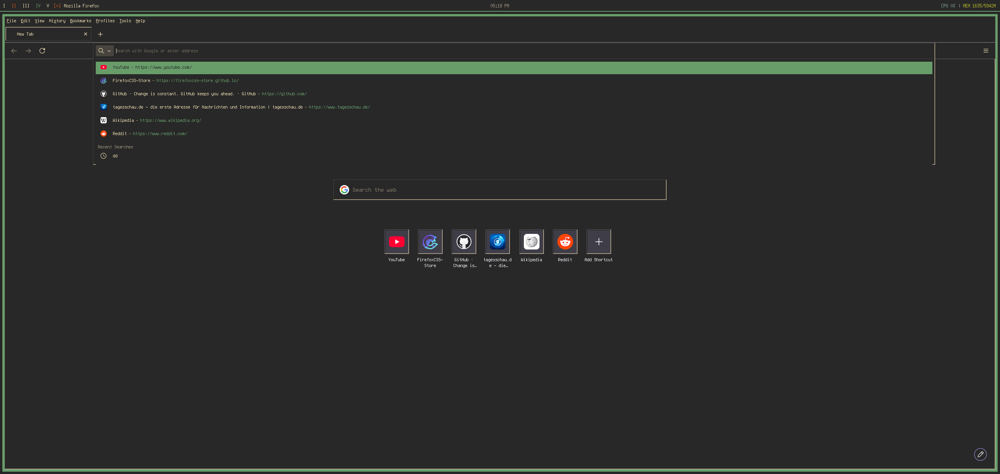

# Gruvbox 98

A Firefox theme combining the gruvbox dark color scheme with a retro Windows 98 / Chicago98 look.

Based on [osem598/Firefox-98](https://github.com/osem598/Firefox-98).

## Preview

## Installation

1. Go to `about:config` and set `toolkit.legacyUserProfileCustomizations.stylesheets` to `true`
2. Go to `about:support` → Profile Folder → Open Folder
3. Copy `userChrome.css` and `userContent.css` into the `chrome/` folder
4. Restart Firefox

## Colors

| Variable | Color |
|---|---|
| Toolbar/Background | `#282828` |
| Text | `#ebdbb2` |
| Highlight | `#689d6a` |
| Focus | `#458588` |

## Credits

- [osem598/Firefox-98](https://github.com/osem598/Firefox-98) — Original Windows 98 theme
- Gruvbox color scheme
- Terminus font
